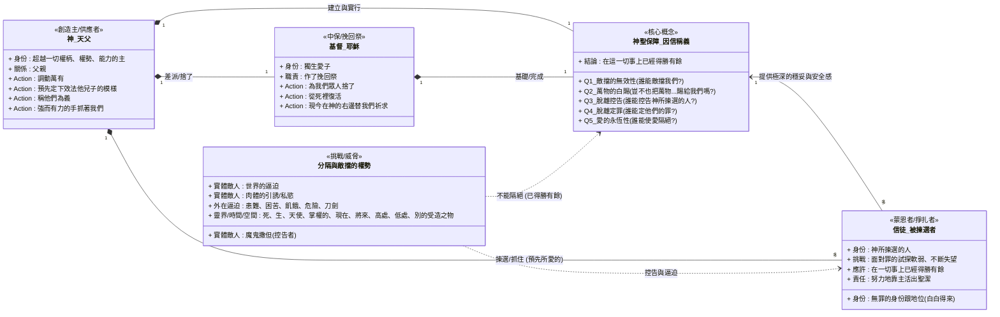

永不隔絕的愛：羅馬書八章31-39節的深度解析與牧養應用

1. 主題與結論

1.1. 核心主題與論點

作為一位長期沉浸在聖經文本中的分析者，我深知羅馬書第八章的這段結語，不僅是優美的詩歌，更是整個基督信仰基石的堅定宣告。本文的核心論題是：基於「因信稱義」這項無可動搖的真理，無論是信徒內在最深層的軟弱掙扎，還是外在世界一切可想像的敵對權勢，都絕對無法使我們與上帝在基督耶穌裡的愛隔絕。

這個結論並非憑空而來，它是使徒保羅從羅馬書三章21節起，層層遞進、嚴密論證的神學高峰。它宣告了一場終極的勝利，為所有在成聖道路上感到疲憊、挫敗甚至絕望的信徒，提供了終極的安全感與永不失落的盼望。這份愛，不是靠我們緊抓不放，而是源於上帝大能之手的緊緊相握。

1.2. 分析範圍

本報告的分析範疇將完全基於蔡金龍牧師對羅馬書8章31-39節的逐節講解。我們的目標是深入剖析使徒保羅如何透過五個鏗鏘有力、無法辯駁的提問，揭示出上帝救贖計畫的完備性與祂永不改變的愛。同時，我們將探討這些神學真理如何直接回應信徒在日常生活中所面臨的內在控告與外在困境，並提供實際的牧養應用。

--------------------------------------------------------------------------------

以下是基於羅馬書 8:31-39 講稿內容所繪製的 Mermaid 類別圖：

--------------------------------------------------------------------------------

3. 核心論證結構圖表化

為了清晰地呈現保羅在這段經文中無懈可擊的論證邏輯，我們可以將其核心的五個反問句，以及蔡牧師所闡釋的答案與神學基礎，歸納如下表。這五個問題環環相扣，從上帝的幫助開始，層層遞進，最終歸結於祂永不隔絕的愛。

這段羅馬書 8:31-39 節的經文，是使徒保羅對「因信稱義」真理的偉大總結和結論。在影片講稿中，講者指出保羅使用了**五個挑戰性問題**來強調上帝的愛、幫助與祝福，這些問題構成了基督徒在上帝愛中的「五大確據」。

以下表格總結了這五大確據：

### 羅馬書第八章的五大確據（8:31-39）

根據您的要求，以下是羅馬書 8:31-39 節所闡述的五大確據，僅包含「挑戰（問題）」與「核心內容（結論）」兩欄，並引用相關的出處：

### 羅馬書第八章五大確據總結

| 挑戰（保羅的問題） | 核心內容（結論與總結） |
| :--- | :--- |
| **神若幫助我們，誰能敵擋我們呢？** | **敵擋無效：**答案是不能。因為再沒有任何權勢比上帝都大。這個不敬虔的世界、肉體的引誘私慾、以及魔鬼撒但的工作，都不能敵擋我們。 |
| **神既不愛惜自己的兒子... 豈不也把萬物和他一同白白地賜給我們嗎？** | **供應豐盛：**上帝既然連獨生愛子耶穌都賜給我們了，祂必會用盡一切、調動萬物來成全、建造、幫助我們。 |
| **誰能控告神所揀選的人呢？** | **免於控告：**有神稱他們為義了。我們擁有無罪的身份跟地位，這是白白得來的。當惡者撒但惡意控告我們時，我們不需要害怕，因為我們被神稱為義了。 |
| **誰能定他們的罪呢？** | **免於定罪：**有基督耶穌已經死了，而且從死裡復活，現今在神的右邊，也替我們祈求。祂作了挽回祭，我們的罪已經完完全全地歸到耶穌基督身上。 |
| **誰能使我們與基督的愛隔絕呢？** | **永不隔絕：**沒有任何的事物，包括患難、困苦、逼迫、飢餓、赤身露體、危險、刀劍，或是死、生、時間（現在或將來）、空間（高處或低處）、靈界權勢（天使、掌權的、有能的）、或別的受造之物，都不能夠隔絕我們與神的愛。**我們是「靠著愛我們的主，在這一切事上已經得勝有餘了」**。這穩妥感是來自上帝強而有力的手拉著我們。 |

**總結這極深的穩妥：**

這份安全感並非來自於我們自己努力抓住上帝，而是因為**上帝強而有力的手拉著我們**，祂的能力超越一切權柄和權勢。因信稱義給了我們真正的盼望，使我們在極大的安全感裡面，能夠努力地靠主活出聖潔的生活。

--------------------------------------------------------------------------------

4. 核心論點綱要卡片

在進入詳細闡述之前，此處以綱要卡片的形式，簡潔地呈現每個核心論點的結構，幫助讀者快速掌握保羅論證的精髓。

第一問：誰能敵擋我們？

* 定義： 上帝若主動成為我們的幫助，就沒有任何敵對勢力（世界、肉體、魔鬼）能根本上勝過我們。
* 方法/步驟： 認識到上帝是至高的權柄，祂調動萬有來幫助、建造並成全我們。
* 範例： 即使面對如ISIS般的逼迫，或內在肉體的私慾引誘，最終都無法敵擋上帝在我們生命中的旨意。

第二問：上帝豈不把萬物白白賜給我們嗎？

* 定義： 上帝連最寶貴的獨生子都為我們捨了，就沒有任何事物會吝於賜給我們以成全救恩。
* 方法/步驟： 以「最大到最小」的邏輯進行推論：既然上帝付出了終極的代價（祂的兒子），那麼其他萬物（為使我們得益處所需的一切）自然也會一併賜下。
* 範例： 天父差派耶穌為我們捨命，這一最大恩典保證了祂會供應我們成聖過程所需的一切。

第三問：誰能控告神所揀選的人呢？

* 定義： 儘管信徒仍會軟弱犯罪，但任何控告（無論來自撒但、他人或自己）在上帝「稱我們為義」的判決面前都無法成立。
* 方法/步驟： 緊緊抓住上帝所賜予的「無罪的身份跟地位」，以此對抗內心的控告聲。
* 範例： 當因說謊、苦毒或陷入酒精、色情的捆綁而自責時，要記住是上帝稱我們為義，而非我們的行為。

第四問：誰能定我們的罪呢？

* 定義： 我們的罪債已完全由基督承擔，祂的死與復活使我們免於被定罪。
* 方法/步驟： 將信心的錨點定在基督已完成的救贖工作上——祂已死、已復活，並在父神右邊為我們祈求。
* 範例： 耶穌作為我們的挽回祭，已經徹底處理了罪的問題，因此定罪的權柄已不復存在。

第五問：誰能使我們與基督的愛隔絕呢？

* 定義： 任何受造之物，無論是外在的苦難、內在的掙扎、時間、空間還是靈界的力量，都無法切斷我們與上帝在基督裡的愛的連結。
* 方法/步驟： 認識到這份安全感源於上帝大能的手緊抓著我們，而非我們自己軟弱地抓住祂。
* 範例： 無論是飢餓、危險、刀劍，甚至是死亡本身，都不能使我們與神的愛隔絕。

--------------------------------------------------------------------------------

5. 各項論點詳細說明

5.1. 第一與第二確據：上帝的供應與保護

這兩個問題共同確立了信徒在成聖道路上所需的一切外在與內在資源的保障，其根基在於上帝的至高主權與極致的愛。保羅的論證始於一個承先啟後的宣告：「既是這樣」。

這句話直接承接上文的偉大真理：上帝使萬事互相效力，叫愛祂的人得益處；祂預先定下我們，呼召我們，稱我們為義，並最終要叫我們得榮耀。在聖父、聖子、聖靈都已為我們的救恩全力以赴的背景下，保羅拋出了第一個問題：「神若幫助我們，誰能敵擋我們呢？」答案不言而喻。蔡牧師指出，我們的敵人主要有三：不敬虔的世界（帶來逼迫）、我們自身的肉體（帶來私慾引誘）以及魔鬼撒但。然而，既然上帝是宇宙中至高的權柄，這一切敵對勢力都無法根本性地阻撓祂幫助、建造並成全我們的計畫。

緊接著，第二個問題將這份保障推向了高峰。保羅運用了一個無可辯駁的「舉重以明輕」的論證：「神既不吝惜自己的兒子，為我們眾人捨了，豈不也把萬物和他一同白白地賜給我們嗎？」蔡牧師精準地闡釋，上帝已經付出了祂所能付出的最大、最寶貴的代價——祂的獨生愛子。如果連這份終極的禮物祂都願意給，那麼，為了成全這份救恩所需要的其他「萬物」（包括力量、智慧、供應等），祂又怎會吝於賜下呢？這個問題粉碎了我們因缺乏或困境而產生的疑慮，確立了上帝供應的絕對可靠性。這份供應與保護的確據，為我們接下來面對內心的控告，打下了堅實的基礎。

5.2. 第三與第四確據：法律地位的穩固

在確立了上帝外在的保護後，保羅接著轉向一個法庭場景，處理信徒內心最深沉的恐懼——因自身的軟弱和罪行而產生的罪咎感與被定罪的恐懼。這兩個問題旨在徹底粉碎撒但的控告，確立我們在基督裡不可動搖的法律地位。

「誰能控告神所揀選的人呢？」保羅直面問題的核心。蔡牧師生動地描繪了撒但作為「控告者」的角色，在我們軟弱時於耳邊低語：「你看，你又讓上帝失望了」、「你根本配不上祂的愛」。這些控告聲在我們陷入苦毒、說謊，或是在面對酒精與色情的捆綁而反覆失敗時尤其猛烈，企圖使我們失去力量。然而，保羅給出的答案是終極的：「有神稱他們為義了」。這句話將法庭的權柄從控告者手中奪回，交給了最高的審判官——上帝自己。是祂，而不是我們的表現，宣告了我們「無罪的身份跟地位」。

第四個問題「誰能定我們的罪呢？」則進一步鞏固了這個判決。定罪之所以不可能，是因為基督耶穌已經為此付出了完全的代價。蔡牧師詳解道，基督的工作是四重的：祂已經死了（作為挽回祭，承擔了罪罰），從死裡復活（證明祂勝過了罪與死），並且現今在神的右邊，也替我們祈求。這意味著罪的問題已經被徹底、永久地解決了。有聖靈在我們裡面代求，又有基督在父神右邊代求，任何定罪的判決都已失去了法理依據。總結而言，信徒的身份是由上帝的宣告所定義，而非由個人的表現所決定。這份穩固的法律地位，使我們能坦然面對下一個，也是最終極的挑戰。

5.3. 第五確據：永不隔絕的愛

這是整個論述的最高潮，也是所有確據的根源。保羅在此提出一個終極問題，旨在證明沒有任何力量能動搖信徒與基督之愛的連結，這份愛是我們信仰安全感的最終源頭。

「誰能使我們與基督的愛隔絕呢？難道是患難嗎？是困苦嗎？是逼迫嗎？是飢餓嗎？是赤身露體嗎？是危險嗎？是刀劍嗎？」保羅列出了一系列信徒可能遭遇的極端困境。蔡牧師將其分為外來的逼迫（患難、逼迫、危險、刀劍）與內在的掙扎或缺乏（困苦、飢餓、赤身露體）。他引用詩篇44篇的「我們為你的緣故終日被殺，人看我們如將宰的羊」，深刻描繪了信徒在這些處境中可能感受到的極度無助與絕望。

然而，保羅的宣告卻是顛覆性的：「然而，靠著愛我們的主，在這一切的事上已經得勝有餘了。」這不是說我們不會經歷痛苦，而是說，在這些痛苦之中，我們藉著主的愛，能夠獲得一種超越性的勝利。

最後，保羅在38-39節以排山倒海的氣勢，窮盡了一切受造界的可能，來證明這份愛的牢不可破。「死、生」超越了生命的界線；「天使、掌權的、有能的」涵蓋了靈界一切權勢；「現在的事、將來的事」跨越了所有時間；「高處的、低處的」囊括了所有空間；最後一句「別的受造之物」則將所有未言明的可能性一網打盡。結論是：沒有任何受造之物，能叫我們與神的愛隔絕。

為了讓這個真理更深地烙印在我們心中，蔡牧師分享了一個觸動人心的畫面：一位父親牽著一個小女孩的手走在美麗的校園裡。小女孩很開心，蹦蹦跳跳，一下看看樹，一下看看松鼠，因分心而一個踉蹌，眼看就要摔倒。牧師說，當他迎面看到這一幕時，「心裡面就一揪」，為她感到緊張。然而，奇妙的是，那女孩的笑容沒有絲毫改變，她帶著笑容往前仆去。原來，她身旁的父親 calmly and effortlessly（很從容地）一把就將她抓穩了。那雙強而有力的手，始終緊緊拉著她。這個比喻生動地闡明了「因信稱義」所帶來的安全感——關鍵不在於我們這隻軟弱、隨時會鬆開的小手如何抓住上帝，而在於天父那大能、永不放開的手緊緊抓著我們。我們的穩妥，源於祂的信實與大能，而非我們自己的努力。

--------------------------------------------------------------------------------
2. 摘要與背景

2.1. 寫作背景分析

理解任何文本，都必須先理解其所處的脈絡。蔡牧師的這篇講道，正是在一個特定的場景中，為了解決一個真實存在的問題。我們可以從以下幾個層面來重建其背景：

* 文本來源 (Domain): 這是一篇針對聖經《羅馬書》8章31-39節的講道解經。這段經文本身就是保羅對「因信稱義」教義的總結性陳詞，充滿了確據與盼望。
* 目標受眾 (Audience): 講道的對象是基督徒群體（弟兄姊妹）。蔡牧師的語氣和舉例表明，這些聽眾並非信仰的初學者，而是可能正在成聖道路上經歷真實掙扎與軟弱的信徒。
* 核心問題 (Problem): 信徒們面臨著一個雙重困境。外在層面，他們可能面對來自不敬虔世界的逼迫、危險甚至生命的威脅（如ISIS的例子）。內在層面，他們更要面對肉體的私慾、罪的捆綁（如牧師提到的信徒在酒精或色情上的掙扎）、苦毒、說謊，以及隨之而來的、源自撒但或自身的猛烈控告，這些控告使他們對自己失望，甚至懷疑上帝的愛。
* 講道目標 (Goal): 本篇講道的核心目標，是透過權威的經文解釋，幫助信徒建立一個「不會失落的盼望」和「極深的安全感」。蔡牧師要引導聽眾將信心的錨，從自己搖擺不定的行為表現，轉而拋向上帝永不改變的揀選與慈愛，使其確信，沒有任何事物能使他們與這份愛隔絕。

2.2. 關鍵術語定義

為了確保接下來的分析清晰準確，我們首先定義幾個在講道中反覆出現的核心神學術語。

術語（中英對照）	一句話定義
因信稱義 (Justification by Faith)	指信徒不是靠好行為，而是單單藉著相信耶穌基督而被上帝宣告為無罪的身份地位。
成聖 (Sanctification)	指信徒在得救後，靠著聖靈的大能，生命逐漸脫離罪惡、活出聖潔的過程。
挽回祭 (Propitiation)	指耶穌基督的死滿足了上帝對罪的公義要求，平息了祂的忿怒。

---

6. 總結與祈禱事項

6.1. 核心信息總結

身為牧者，我深知在成聖的漫長路途中，我們常會因反覆的軟弱與失敗而對自己失望。我們當中或許有人正像牧師所提到的那位弟兄，因反覆的失敗，甚至覺得連自己認罪的禱告都無法相信，覺得自己不配再向上帝祈求。然而，羅馬書第八章的這段經文，正是上帝給我們的偉大應許與安慰。它告訴我們，「因信稱義」不僅是一個神學名詞，更是一份帶來極大安全感與盼望的禮物。我們的得救，不是靠行為去賺取，而是白白領受的恩典。因此，好行為不是得救的條件，而是在擁有了這份永不失落的愛之後，靠著主的大能，從生命中自然流露出來的樣式。

所以，我親愛的弟兄姊妹，如果你正處在軟弱和掙扎中，請記得：你可以一次、兩次、三次……不斷地回到上帝面前。因為聖靈在為你歎息，基督在為你祈求，天父正用祂大能的手緊抓著你。沒有任何事，能叫祂在基督耶穌裡的愛，與你隔絕。

6.2. 祈禱事項

* 為那些因持續的軟弱和失敗而對自己失望、甚至不敢禱告的信徒祈禱，求主讓他們深刻領受這份永不隔絕的愛，能重新得力，坦然無懼地回到天父面前。
* 為正在面對外在逼迫、困苦和危險的基督徒禱告，求主讓他們堅信，即便是死亡也無法使他們與基督的愛分離，並賜給他們那份超越環境的、「得勝有餘」的信心。
* 祈求聖靈幫助我們，能將「因信稱義」的真理不僅停留在頭腦的知識層面，更能深刻地根植在我們心中，成為我們面對一切內在、外在控告和試探時的力量來源。
* 為我們自己禱告，當我們感覺像「將宰的羊」一樣無助時，能真實地感受到天父那雙強而有力的手正緊緊牽著我們，使我們在祂裡面有極深的穩妥與平安。

