### 1. 如圖，橘色部分的面積是 ? 平方公分。
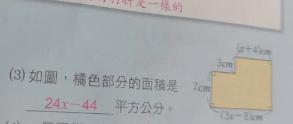
> * ==**重點提示：** 將兩部分的面積相加得出總面積==

圖中標示的長度：
*   左側垂直邊長：$7\,cm$
*   底部水平邊長：$(3x - 8)\,cm$
*   右上水平邊長：$(x + 4)\,cm$
*   中間連接的垂直小邊長：$3\,cm$

**答案：**
橘色部分的面積是 **$24x - 44$** 平方公分。

### 2. <u>小翊</u>和<u>小靖</u>兩人輪流讀同一本 $x$ 頁的書，<u>小翊</u>第一天讀了全書的 $\frac{1}{6}$ 多 14 頁，第二天讀了全書的 $\frac{1}{3}$ 少 20 頁；第三天<u>小靖</u>讀了全書的 $\frac{1}{4}$ 少 4 頁，則這本書還剩幾頁沒有讀？(以 $x$ 表示並化簡)
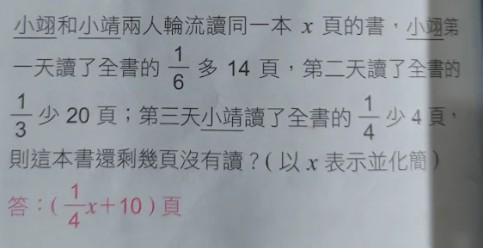
> * ==**重點提示：** 將所有包含 $x$ 的分數項 $\left(\frac{1}{6}x, \frac{1}{3}x, \frac{1}{4}x\right)$ 進行通分==

答：$(\frac{1}{4}x + 10)$ 頁

### 4. 新運算符號問題

*   **題目內容：** 如果 "*" 是一個新的運算符號，它的計算方法是 「$a * b = ab - 3a + 2b$」，例如 $5 * (-3) = 5 \times (-3) - 3 \times 5 + 2 \times (-3) = -36$，今若 $x * 4 = 0$，則 $x$ 值為 \_\_\_\_\_\_。
> * ==**重點提示：** 依據定義的規則代入：$x * 4 = x \times 4 - 3 \times x + 2 \times 4$。==

**答案：** $x = -8$

### 講解 1 【雞兔問題】

*   **題目內容：** 小健全班至墾丁郊遊，38 人共租了 16 輛協力車。每輛只能兩人共騎或三人共騎。請問在這 16 輛協力車中，由兩人共騎的有幾輛？
> * ==**重點提示：** 設兩人共騎有 $x$ 輛，則三人共騎有 $(16 - x)$ 輛。總人數 = $2x + 3(16 - x) = 38$。==

**答案：** 10 輛

### 講解 2 【年齡問題(1)】
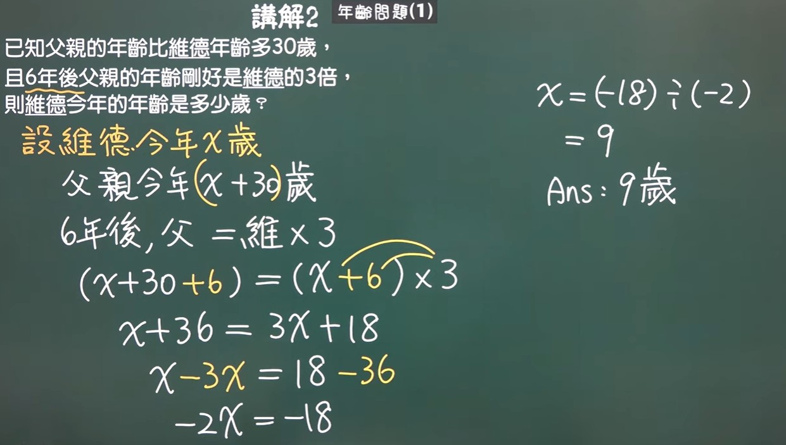
*   **題目內容：** 已知父親的年齡比維德年齡多 30 歲，且 6 年後父親的年齡剛好是維德的 3 倍，則維德今年的年齡是多少歲？
> * ==**重點提示：** 設維德今年 $x$ 歲，父親今年 $(x + 30)$ 歲。6 年後方程式：$(x + 30 + 6) = (x + 6) \times 3$。==

**答案：** 9 歲

### 講解 3 【年齡問題(2)】

*   **題目內容：** 杰倫問老師今年幾歲，老師說：「我的年齡與我兒子的年齡相差 28 歲；且 8 年後，我的年齡是兒子的 5 倍多 4 歲。」則老師今年幾歲？老師的兒子今年幾歲？
> * ==**重點提示：** 設兒子今年 $x$ 歲，老師今年 $(x + 28)$ 歲。8 年後：$(x + 28 + 8) = (x + 8) \times 5 + 4$。注意此題解出之 $x$ 為負數，故不合常理。==

**答案：** 無解

### 講解 4 【分配問題】
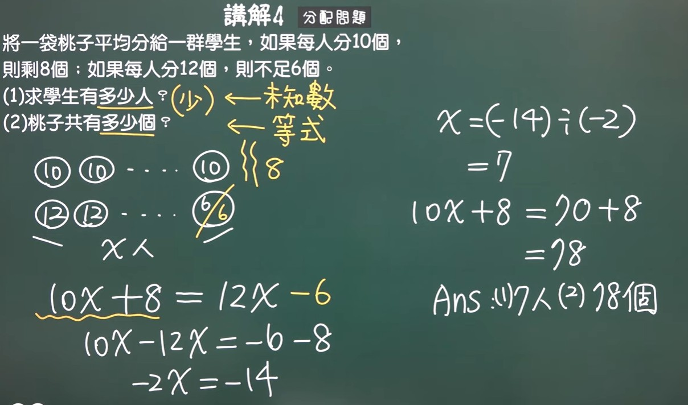
*   **題目內容：** 將一袋桃子平均分給一群學生，如果每人分 10 個，則剩 8 個；如果每人分 12 個，則不足 6 個。(1)求學生有多少人？(2)桃子共有多少個？
> * ==**重點提示：** 設學生有 $x$ 人。桃子總數：$10x + 8 = 12x - 6$。==

**答案：** (1) 7 人 (2) 78 個

### 講解 5 【倍數問題】
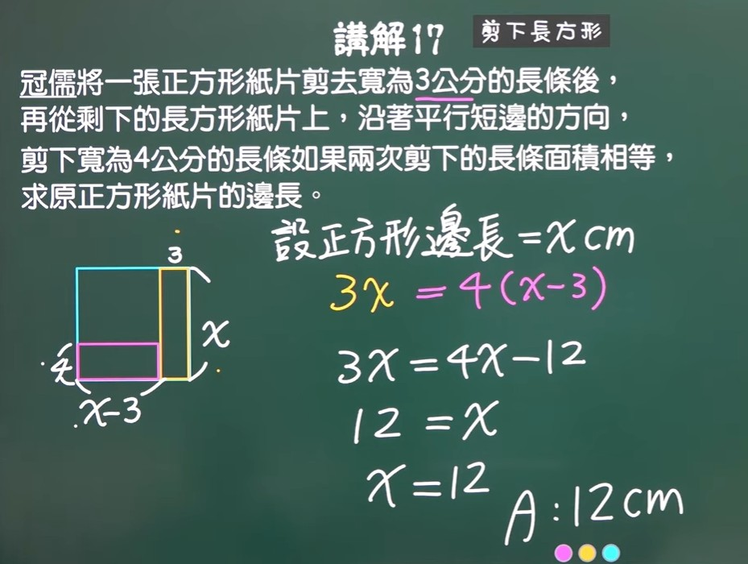
*   **題目內容：** 已知甲的錢是乙的 2 倍，乙比丙多 1 元，丙比甲少 11 元，求三人的錢共有多少元？
> * ==**重點提示：** 設乙為 $x$ 元，則甲為 $2x$ 元，丙為 $(x - 1)$ 元。依據「丙比甲少 11 元」列式：$(x - 1) = 2x - 11$。==

**答案：** 39 元

### 講解 6 【同時加或同時減】
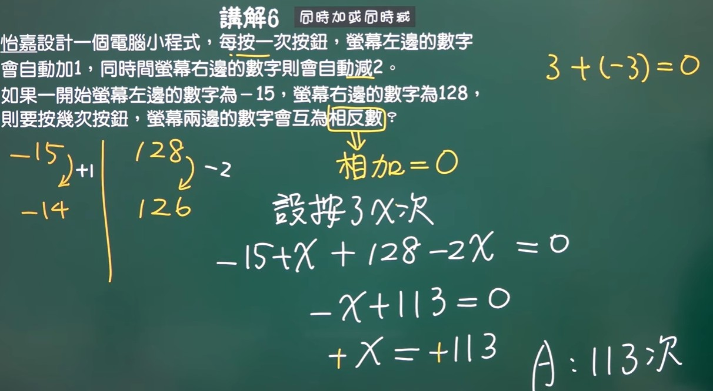
*   **題目內容：** 怡嘉設計一個電腦小程式，每按一次按鈕，螢幕左邊的數字會自動加 1，同時螢幕右邊的數字則會自動減 2。如果一開始螢幕左邊的數字為 -15，螢幕右邊的數字為 128，則要按幾次按鈕，螢幕兩邊的數字會互為相反數？
> * ==**重點提示：** 互為相反數代表兩數相加等於 0。設按了 $x$ 次，方程式：$(-15 + x) + (128 - 2x) = 0$。==

**答案：** 113 次

### 講解 7 【賺與賠】
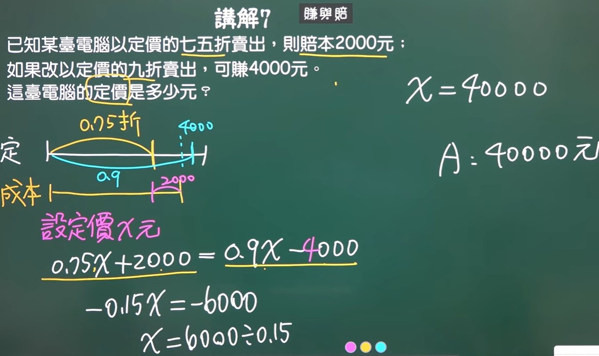
*   **題目內容：** 已知某台電腦以定價的七五折賣出，則賠本 2000 元；如果改以定價的九折賣出，可賺 4000 元。這台電腦的定價是多少元？
> * ==**重點提示：** 成本在不同的賣價下是相同的。設定價為 $x$ 元，方程式：$0.75x + 2000 = 0.9x - 4000$。==

**答案：** 40000 元

### 講解 8 【上山下山】
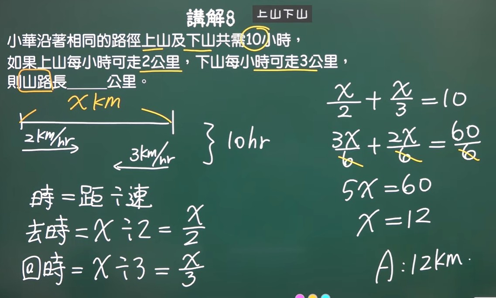
*   **題目內容：** 小華沿著相同的路徑上山及下山共需 10 小時，如果上山每小時可走 2 公里，下山每小時可走 3 公里，則山路長 \_\_\_\_\_\_ 公里。
> * ==**重點提示：** 時間 = 距離 / 速度。設山路長 $x$ 公里，方程式：$\frac{x}{2} + \frac{x}{3} = 10$。==

**答案：** 12 公里

### 講解 9 【你多我少】
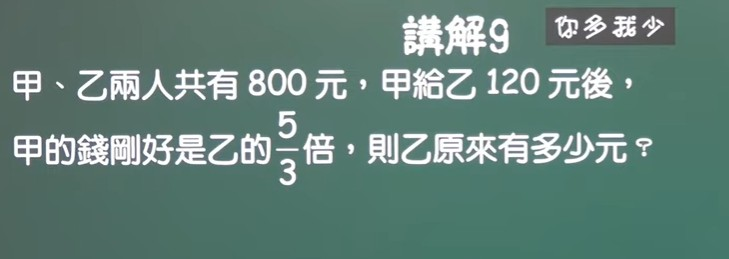
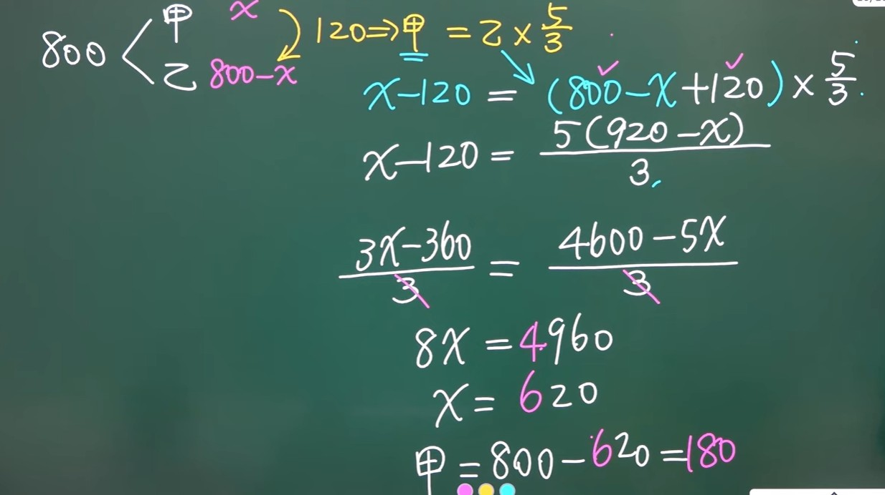
*   **題目內容：** 甲、乙兩人共有 800 元，甲給乙 120 元後，甲的錢剛好是乙的 $\frac{5}{3}$ 倍，則乙原來有多少元？
> * ==**重點提示：** 設甲原本有 $x$ 元，乙原本有 $(800 - x)$ 元。甲給乙 120 元後，甲剩 $(x - 120)$ 元，乙變為 $(920 - x)$ 元。方程式：$(x - 120) = (920 - x) \times \frac{5}{3}$。==

**答案：** 180 元

### 講解 10 【周長與面積】
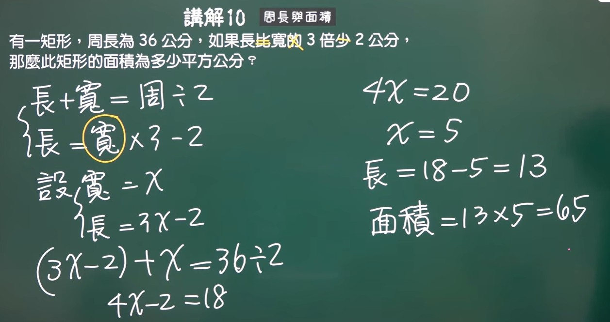
*   **題目內容：** 有一矩形，周長為 36 公分，如果長比寬的 3 倍少 2 公分，那麼此矩形的面積為多少平方公分？
> * ==**重點提示：** 設寬為 $x$ 公分，則長為 $(3x - 2)$ 公分。長 + 寬 = 周長 / 2。方程式：$(3x - 2) + x = 18$。==

**答案：** 65 平方公分

### 講解 11 【繩長與折數】
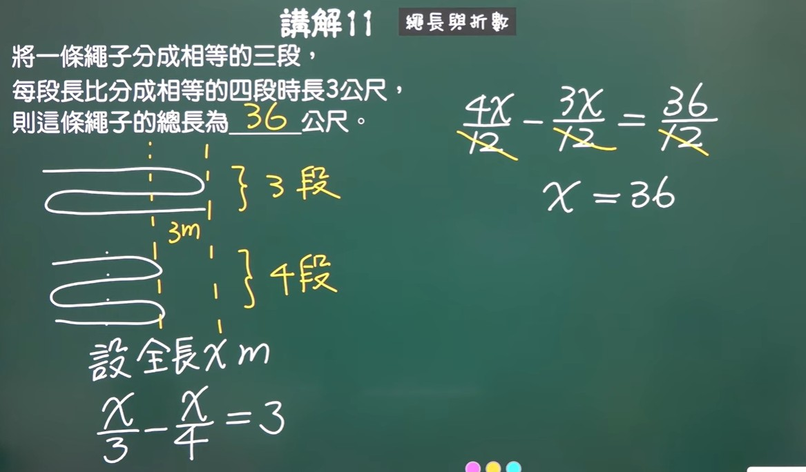
*   **題目內容：** 將一條繩子分成相等的三段，每段長比分成相等的四段時長 3 公尺，則這條繩子的總長為 \_\_\_\_\_\_ 公尺。
> * ==**重點提示：** 設全長 $x$ 公尺。方程式：$\frac{x}{3} - \frac{x}{4} = 3$。==

**答案：** 36 公尺

### 12. 二位數問題 十位數, 個位數
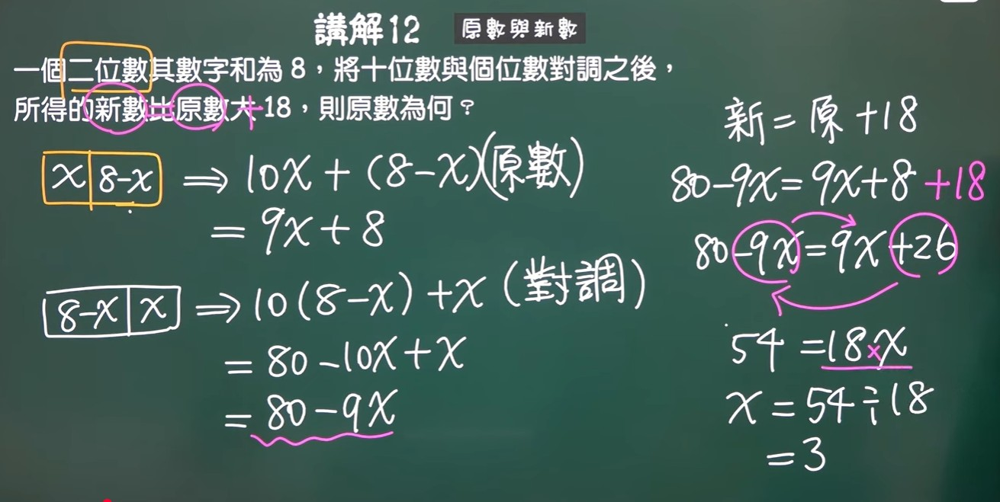

*   **題目內容：** 有一個二位數，其**數字和是 8**。如果將其十位數和個位數**對調**之後，**新數比原數大 18**。
> * ==**重點提示：** 需使用**位值原理**：數值等於十位數 $\times 10$ 加上個位數 $\times 1$。==
*   **最終列式：** **$80 - 9x = (9x + 8) + 18$**。

### 13. 人數分組與麵包分配問題
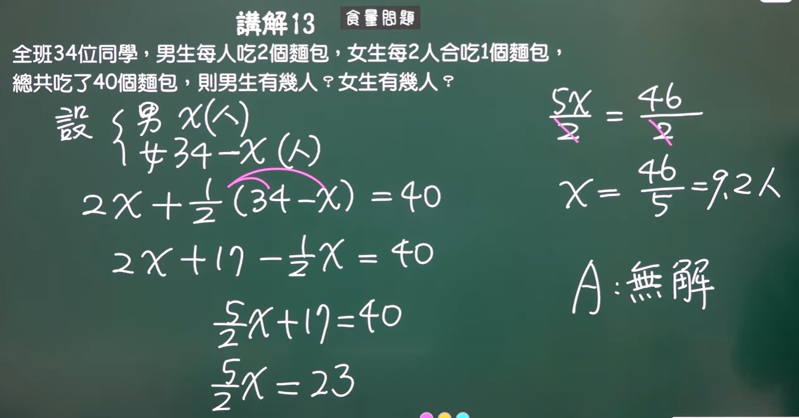

*   **題目內容：** 全班共有 **34 位同學**。**男生一個人吃 2 個麵包**，**女生兩個人合吃 1 個**麵包。總共吃掉了 **40 個麵包**。
> * ==**重點提示：** 數量關係式是：男生吃掉的麵包數 + 女生吃掉的麵包數 $=$ 總麵包數。==
*   **最終列式：** **$2x + \frac{1}{2}(34 - x) = 40$**。

### 14. 測驗計分與倒扣問題
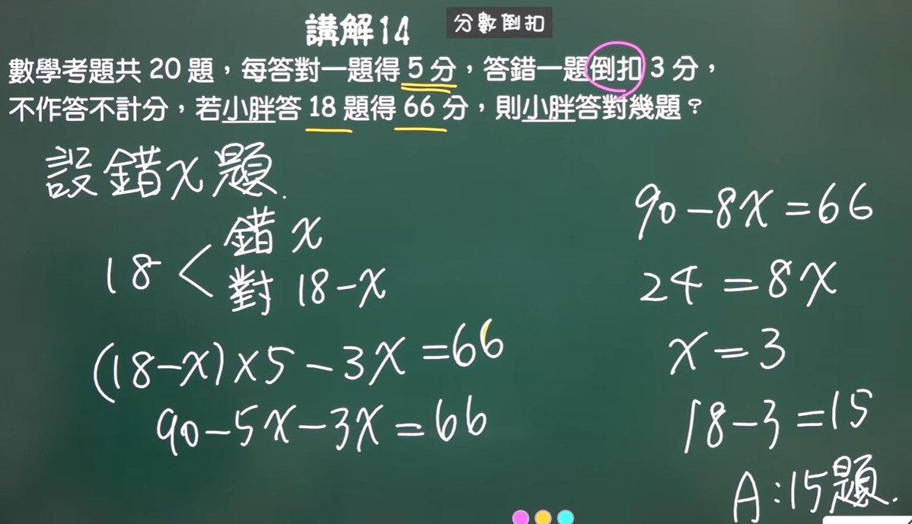

*   **題目內容：** 數學測驗**總共 20 題**。**答對一題得 5 分**，**答錯一題扣 3 分**。若總共答了 **18 題**，**得了 66 分**。
> * ==**重點提示：** 總分公式為：答對題數 $\times$ 得分 $-$ 答錯題數 $\times$ 扣分 $=$ 總得分。==
*   **最終列式：** **$(18 - x) \times 5 - x \times 3 = 66$**。

### 15. 竹竿長度問題
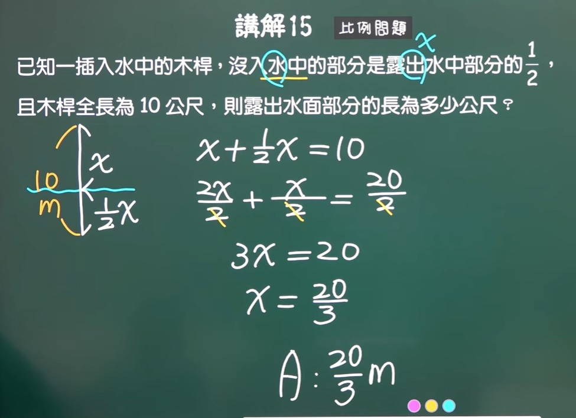

*   **題目內容：** 已知一根木竿插入水中，**沒入水中的部分**是**露出水面部分**的 **$\frac{1}{2}$**。竹竿**全長是 10 公尺**。
> * ==**重點提示：** 核心觀念是：露出部分長度 + 沒入部分長度 $=$ 全長。==
*   **最終列式：** **$x + \frac{1}{2}x = 10$**。

### 16. 混合液體與濃度問題
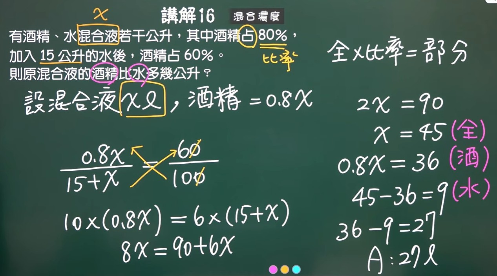

*   **題目內容：** 某**酒精水混合液若干公升**，其中**酒精佔了 80%**。如果**加入了 15 公升的水**，酒精變成佔**全部的 60%**。
==*   **重點提示：** 解題公式為：全體 $\times$ 比率 $=$ 部分（酒精量）。此題中，酒精量在加水前後維持不變。==
*   **最終列式：** **$\frac{0.8x}{x + 15} = 0.6$**。

### 17. 面積相等問題

*   **題目內容：** 郭如將一張正方形紙片，先**剪去寬為 3 公分的長條**。再從剩下的紙片上，沿著平行短邊的方向**剪去一條寬為 4 公分的長條**。結果**這兩次剪下來的面積都一樣**。
==*   **重點提示：** 面積公式為：面積 $=$ 長 $\times$ 寬。==
*   **最終列式：** **$3x = 4(x - 3)$**。

