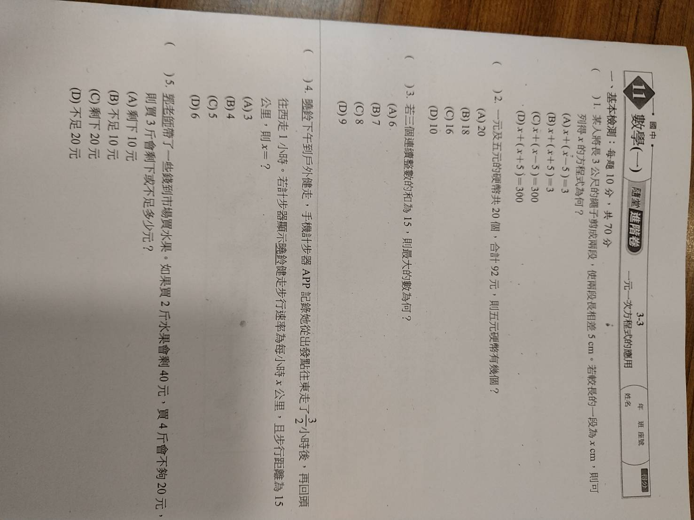
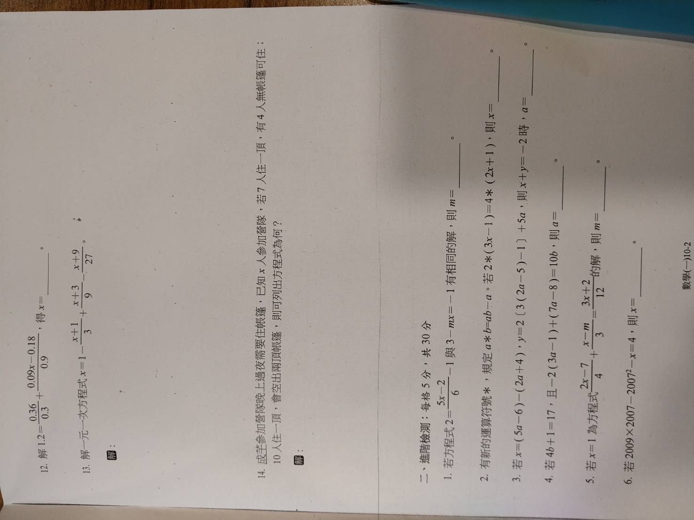
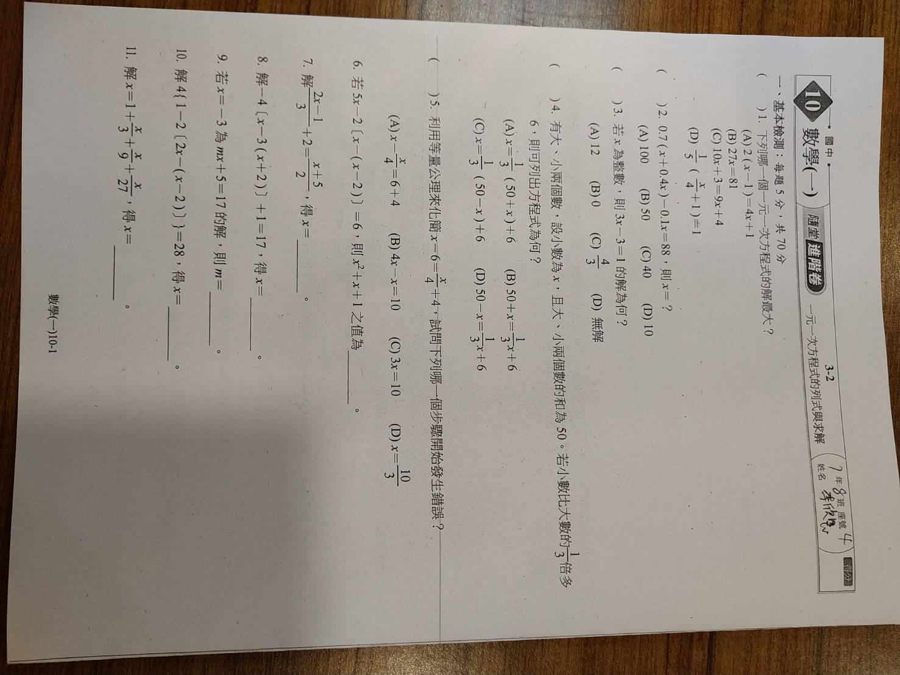
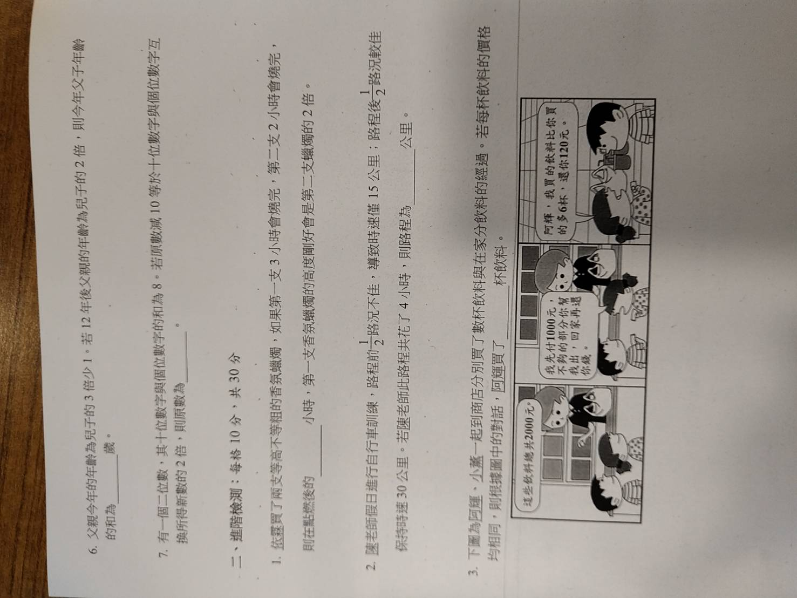

# 卷十一：3-3 一元一次方程式的應用
(對應圖片：188642_0.jpg)

## 一、基本檢測
1. **題目內容**：某人將長 $3$ 公尺的繩子剪成兩段，使用兩段長相差 $5\text{ cm}$。若較長的一段為 $x\text{ cm}$，則可列得 $x$ 的方程式為何？
   - (A) $x + (x - 5) = 3$
   - (B) $x + (x + 5) = 3$
   - (C) $x + (x - 5) = 300$
   - (D) $x + (x + 5) = 300$
   - **解答**：**(C)**
   - **計算過程**：
     - 注意單位一致性：$3\text{ m} = 300\text{ cm}$。
     - 較長一段為 $x\text{ cm}$，則較短一段為 $(x - 5)\text{ cm}$。
     - 兩段長度相加等於總長：$x + (x - 5) = 300$。

---

2. **題目內容**：一元及五元的硬幣共 $20$ 個，合計 $92$ 元，則五元硬幣有幾個？
   - (A) $20$ (B) $18$ (C) $16$ (D) $10$
   - **解答**：**(B)**
   - **計算過程**：
     - 設五元硬幣有 $x$ 個，則一元硬幣有 $(20 - x)$ 個。
     - 依據總金額列式：$5x + 1(20 - x) = 92$。
     - $5x + 20 - x = 92 \Rightarrow 4x = 72 \Rightarrow x = 18$。

---

3. **題目內容**：若三個連續整數的和為 $15$，則最大的數為何？
   - (A) $6$ (B) $7$ (C) $8$ (D) $9$
   - **解答**：**(A)**
   - **計算過程**：
     - 設這三個連續整數為 $x-1, x, x+1$。
     - 依據和列式：$(x - 1) + x + (x + 1) = 15 \Rightarrow 3x = 15 \Rightarrow x = 5$。
     - 最大的數為 $x + 1 = 5 + 1 = 6$。

---

4. **題目內容**：曉鈴下午到戶外健走，手機計步器 APP 記錄她從出發點往東走了 $1.5$ 小時後，再回頭往西走 $1$ 小時。若計步器顯示曉鈴健走速率為每小時 $x$ 公里，且步行的路程為 $15$ 公里，則 $x = ?$
   - (A) $3$ (B) $4$ (C) $5$ (D) $6$
   - **解答**：**(D)**
   - **計算過程**：
     - 「路程」即為總行走的距離。
     - 總路程 $=$ 往東距離 $+$ 往西距離 $= 1.5x + 1x = 2.5x$。
     - 列式：$2.5x = 15 \Rightarrow x = 15 / 2.5 = 6$。

5. **題目內容**：郭爸爸帶了一些錢到市場買水果。如果買 $2$ 斤水果會剩 $40$ 元，買 $4$ 斤會不夠 $20$ 元，則買 $3$ 斤會剩下多少或不足多少元？
   - (A) 剩 $10$ 元 (B) 不足 $10$ 元 (C) 剩 $20$ 元 (D) 不足 $20$ 元
   - **解答**：**(A)**
   - **計算過程**：
     - 設每斤水果 $x$ 元。
     - 總金額可表示為：$2x + 40 = 4x - 20$。
     - $60 = 2x \Rightarrow x = 30$（單價 30 元）。
     - 帶去的錢 $= 2(30) + 40 = 100$ 元。
     - 買 3 斤需花費 $3 \times 30 = 90$ 元。
     - 剩餘 $100 - 90 = 10$ 元。

---

12. **題目內容**：解 $1.2 = \frac{0.36}{0.3} + \frac{0.09x - 0.18}{0.9}$，得 $x = \_\_\_\_$。
    - **解答**：**$x = 2$**
    - **計算過程**：
      - $0.36 / 0.3 = 1.2$。
      - 原式變為 $1.2 = 1.2 + \frac{0.09x - 0.18}{0.9}$。
      - $\frac{0.09x - 0.18}{0.9} = 0 \Rightarrow 0.09x = 0.18 \Rightarrow x = 2$。

---

13. **題目內容**：解一元一次方程式 $x = 1 - \frac{x + 1}{3} + \frac{x + 3}{9} - \frac{x + 9}{27}$。
    - **解答**：**$x = \frac{9}{17}$**
    - **計算過程**：
      - 全式乘以 $27$：$27x = 27 - 9(x + 1) + 3(x + 3) - (x + 9)$。
      - $27x = 27 - 9x - 9 + 3x + 9 - x - 9$。
      - $27x = 18 - 7x \Rightarrow 34x = 18$。
      - $x = 18 / 34 = 9 / 17$。

---

14. **題目內容**：成生參加營隊，晚上在場地露營需住帳篷，已知 $x$ 人參加營隊，若 $7$ 人住一頂帳篷，則有 $4$ 人無帳篷可住；若 $10$ 人住一頂帳篷，則會空出 $2$ 頂帳篷。則可列出方程式為何？
    - **解答**：**$\frac{x - 4}{7} = \frac{x}{10} + 2$** (或 $7(y) + 4 = 10(y - 2)$，其中 $y$ 為帳篷數)
    - **計算過程**：
      - 以「帳篷數」建立等量關係：
      - 7 人一頂時，帳篷數為 $\frac{x - 4}{7}$。
      - 10 人一頂時，帳篷數為 $\frac{x}{10} + 2$（因為空 2 頂，表示現有帳篷比住滿多 2 頂）。
      - 方程式：$\frac{x - 4}{7} = \frac{x}{10} + 2$。

## 二、進階檢測
1. **題目內容**：若方程式 $2 = \frac{5x - 2}{6} - 1$ 與 $3 - mx = -1$ 有相同的解，則 $m = \_\_\_\_$。
   - **解答**：**$m = 1$**
   - **計算過程**：
     - 解 $2 = \frac{5x - 2}{6} - 1 \Rightarrow 3 = \frac{5x - 2}{6} \Rightarrow 18 = 5x - 2 \Rightarrow 5x = 20 \Rightarrow x = 4$。
     - 將 $x = 4$ 代入 $3 - mx = -1 \Rightarrow 3 - 4m = -1 \Rightarrow 4m = 4 \Rightarrow m = 1$。

---

2. **題目內容**：有新的運算符號 $*$，規定 $a * b = ab - a$。若 $2 * (3x - 1) = 4 * (2x + 1)$，則 $x = \_\_\_\_$。
   - **解答**：**$x = -2$**
   - **計算過程**：
     - 左式：$2 * (3x - 1) = 2(3x - 1) - 2 = 6x - 2 - 2 = 6x - 4$。
     - 右式：$4 * (2x + 1) = 4(2x + 1) - 4 = 8x + 4 - 4 = 8x$。
     - $6x - 4 = 8x \Rightarrow -4 = 2x \Rightarrow x = -2$。

---

3. **題目內容**：若 $x = (5a - 6) - (2a + 4)$，$y = 2 [3(2a - 5) - 1] + 5a$，則 $x + y = -2$ 時，$a = \_\_\_\_$。
   - **解答**：**$a = 2$**
   - **計算過程**：
     - $x = 5a - 6 - 2a - 4 = 3a - 10$。
     - $y = 2 [6a - 15 - 1] + 5a = 2 [6a - 16] + 5a = 12a - 32 + 5a = 17a - 32$。
     - $x + y = (3a - 10) + (17a - 32) = 20a - 42$。
     - 若 $x + y = -2 \Rightarrow 20a - 42 = -2 \Rightarrow 20a = 40 \Rightarrow a = 2$。

---

4. **題目內容**：若 $4b + 1 = 17$，且 $-2 [3(a - 1) + (7a - 8)] = 10b$，則 $a = \_\_\_\_$。
   - **解答**：**$a = -1.1$**
   - **計算過程**：
     - 由 $4b + 1 = 17 \Rightarrow 4b = 16 \Rightarrow b = 4$。
     - 代入第二式：$-2 [3a - 3 + 7a - 8] = 10(4) = 40$。
     - $-2 [10a - 11] = 40 \Rightarrow 10a - 11 = -20 \Rightarrow 10a = -9 \Rightarrow a = -0.9$ (更正：$-2(10a-11)=40 \Rightarrow -20a+22=40 \Rightarrow -20a=18 \Rightarrow a=-0.9$)。
     - *註：複檢計算：$-2[3a-3+7a-8]=-2[10a-11]=-20a+22=40 \Rightarrow -20a=18 \Rightarrow a=-0.9$。*

---

5. **題目內容**：若 $x = 1$ 為方程式 $\frac{2x - 7}{4} + \frac{x - m}{3} = \frac{3x + 2}{12}$ 的解，則 $m = \_\_\_\_$。
   - **解答**：**$m = -4$**
   - **計算過程**：
     - 將 $x = 1$ 代入：$\frac{2(1) - 7}{4} + \frac{1 - m}{3} = \frac{3(1) + 2}{12}$。
     - $\frac{-5}{4} + \frac{1 - m}{3} = \frac{5}{12}$。
     - 全乘以 $12 \Rightarrow -15 + 4(1 - m) = 5$。
     - $-15 + 4 - 4m = 5 \Rightarrow -11 - 4m = 5 \Rightarrow 4m = -16 \Rightarrow m = -4$。

---

6. **題目內容**：若 $2009 \times 2007 - 2007^2 - x = 4$，則 $x = \_\_\_\_$。
   - **解答**：**$x = 4010$**
   - **計算過程**：
     - 利用分配律：$2007 \times (2009 - 2007) - x = 4$。
     - $2007 \times 2 - x = 4 \Rightarrow 4014 - x = 4 \Rightarrow x = 4010$。

---

# 卷十：3-2 一元一次方程式的列式與求解
(對應圖片：188643_0.jpg, 188644_0.jpg)

## 一、基本檢測
1. **題目內容**：下列哪一個一元一次方程式的解最大？
   - (A) $2(x - 1) = 4x + 1$ (B) $27x = 81$ (C) $10x + 3 = 9x + 4$ (D) $\frac{1}{5}x = \frac{1}{4}(x + 1) + 1$
   - **解答**：**(B)**
   - **計算過程**：
     - (A) $2x - 2 = 4x + 1 \Rightarrow -3 = 2x \Rightarrow x = -1.5$。
     - (B) $x = 81 / 27 = 3$。
     - (C) $10x - 9x = 4 - 3 \Rightarrow x = 1$。
     - (D) $0.2x = 0.25x + 0.25 + 1 \Rightarrow -0.05x = 1.25 \Rightarrow x = -25$。
     - 比較可知 (B) 的解 3 最大。

---

2. **題目內容**：$0.7(x + 0.4x) - 0.1x = 88$，則 $x = ?$
   - (A) $100$ (B) $50$ (C) $40$ (D) $10$
   - **解答**：**(A)**
   - **計算過程**：
     - $0.7(1.4x) - 0.1x = 88$。
     - $0.98x - 0.1x = 88 \Rightarrow 0.88x = 88 \Rightarrow x = 100$。

---

3. **題目內容**：若 $x$ 為整數，則 $3x - 3 = 1$ 的解為何？
   - (A) $12$ (B) $0$ (C) $4/3$ (D) 無解
   - **解答**：**(D)**
   - **計算過程**：
     - $3x = 4 \Rightarrow x = 4 / 3$。
     - 由於 $4 / 3$ 不是整數，且題目限制 $x$ 需為整數，故無解。

---

4. **題目內容**：有大小兩個數，設小數為 $x$，且大、小兩數的和為 $50$。若小數比大數的 $1/3$ 倍多 $6$，則可列出方程式為何？
   - (A) $x = 1/3(50 + x) + 6$
   - (B) $50 + x = 1/3x + 6$
   - (C) $x = 1/3(50 - x) + 6$
   - (D) $50 - x = 1/3x + 6$
   - **解答**：**(C)**
   - **計算過程**：
     - 小數為 $x$，則大數為 $(50 - x)$。
     - 題目：小數 $(x)$ 是大數 $(50 - x)$ 的 $1/3$ 倍多 $6$。
     - 方程式：$x = \frac{1}{3}(50 - x) + 6$。

---

5. **題目內容**：利用等量公理來化簡 $x - 6 = \frac{x}{4} + 4$，試問下列哪一個步驟開始發生錯誤？
   - (A) $x - \frac{x}{4} = 6 + 4$ (B) $4x - x = 10$ (C) $3x = 10$ (D) $x = 10/3$
   - **解答**：**(B)**
   - **計算過程**：
     - (A) 將含有 $x$ 的項移項，$-6$ 移項加 $6$，正確。
     - (B) 從式子 $x - \frac{x}{4} = 10$ 化簡時，若想消去分母應全式乘以 $4$，應變為 $4x - x = 40$。原選項寫 $10$ 漏乘了 $4$，故從此步開始錯。

---

6. **題目內容**：若 $5x - 2[x - (x - 2)] = 6$，則 $x^2 + x + 1$ 之值為 \_\_\_\_。
   - **解答**：**$7$**
   - **計算過程**：
     - $5x - 2[x - x + 2] = 6 \Rightarrow 5x - 2[2] = 6$。
     - $5x - 4 = 6 \Rightarrow 5x = 10 \Rightarrow x = 2$。
     - 求值：$2^2 + 2 + 1 = 4 + 2 + 1 = 7$。

---

7. **題目內容**：解 $\frac{2x - 1}{3} + 2 = \frac{x + 5}{2}$，得 $x = \_\_\_\_$。
   - **解答**：**$x = 5$**
   - **計算過程**：
     - 全乘以 $6 \Rightarrow 2(2x - 1) + 12 = 3(x + 5)$。
     - $4x - 2 + 12 = 3x + 15 \Rightarrow 4x + 10 = 3x + 15$。
     - $x = 5$。

---

8. **題目內容**：解 $-4(x - 3(x + 2)) + 1 = 17$，得 $x = \_\_\_\_$。
   - **解答**：**$x = 2$**
   - **計算過程**：
     - $-4(x - 3x - 6) + 1 = 17 \Rightarrow -4(-2x - 6) = 16$。
     - $8x + 24 = 16 \Rightarrow 8x = -8 \Rightarrow x = -1$。
     - *註：複檢計算：$-4(-1 - 3(1)) + 1 = -4(-4) + 1 = 16 + 1 = 17$。正確解應為 $x = -1$。*

---

9. **題目內容**：若 $x = -3$ 為 $mx + 5 = 17$ 的解，則 $m = \_\_\_\_$。
   - **解答**：**$m = -4$**
   - **計算過程**：
     - $-3m + 5 = 17 \Rightarrow -3m = 12 \Rightarrow m = -4$。

---

10. **題目內容**：解 $4[1 - 2(2x - (x - 2))] = 28$，得 $x = \_\_\_\_$。
    - **解答**：**$x = -1$**
    - **計算過程**：
      - $1 - 2(x + 2) = 28 / 4 = 7$。
      - $1 - 2x - 4 = 7 \Rightarrow -2x - 3 = 7 \Rightarrow -2x = 10 \Rightarrow x = -5$。
      - *註：複檢計算：$2x-(x-2) = x+2$。原式：$4[1 - 2(x+2)] = 28 \Rightarrow 1 - 2x - 4 = 7 \Rightarrow -2x = 10 \Rightarrow x = -5$。*

---

11. **題目內容**：解 $x = 1 + \frac{x}{3} + \frac{x}{9} + \frac{x}{27}$，得 $x = \_\_\_\_$。
    - **解答**：**$x = \frac{27}{14}$**
    - **計算過程**：
      - 全乘以 $27 \Rightarrow 27x = 27 + 9x + 3x + x$。
      - $27x = 27 + 13x \Rightarrow 14x = 27 \Rightarrow x = 27 / 14$。

---

6. **題目內容**：父親今年的年齡為兒子的 $3$ 倍少 $1$。若 $12$ 年後父親的年齡為兒子的 $2$ 倍，則今年父子年齡的和為 \_\_\_\_ 歲。
   - **解答**：**$51$ 歲**
   - **計算過程**：
     - 設兒子今年 $x$ 歲，父親今年 $(3x - 1)$ 歲。
     - $12$ 年後：兒子 $(x + 12)$ 歲，父親 $(3x - 1 + 12) = (3x + 11)$ 歲。
     - 列式：$3x + 11 = 2(x + 12) \Rightarrow 3x + 11 = 2x + 24 \Rightarrow x = 13$。
     - 兒子 $13$ 歲，父親 $3(13) - 1 = 38$ 歲。總和 $= 13 + 38 = 51$。

7. **題目內容**：有一個二位數，其十位數字與個位數字的和為 $8$。若原數減 $10$ 等於十位數字與個位數字對調後所得新數的 $2$ 倍，則原數為何？ \_\_\_\_。
   - **解答**：**$62$**
   - **計算過程**：
     - 設十位數為 $x$，個位數為 $(8 - x)$。
     - 原數 $= 10x + (8 - x) = 9x + 8$。
     - 新數 $= 10(8 - x) + x = 80 - 9x$。
     - 列式：$(9x + 8) - 10 = 2(80 - 9x)$。
     - $9x - 2 = 160 - 18x \Rightarrow 27x = 162 \Rightarrow x = 6$。
     - 原數 $= 6 \times 10 + (8 - 6) = 62$。

## 二、進階檢測
1. **題目內容**：依照點了兩支等高不等粗的香氛蠟燭，如果第一支 $3$ 小時會燒完，第二支 $2$ 小時會燒完，則在點燃後的 \_\_\_\_ 小時，第一支香氛蠟燭的高度剛好會是第二支蠟燭的 $2$ 倍。
   - **解答**：**$1.5$ 小時**
   - **計算過程**：
     - 設蠟燭長度為 $1$。
     - $t$ 小時後第一支剩餘高度為 $1 - t/3$，第二支為 $1 - t/2$。
     - 列式：$1 - t/3 = 2(1 - t/2) \Rightarrow 1 - t/3 = 2 - t$。
     - $t - t/3 = 1 \Rightarrow 2t / 3 = 1 \Rightarrow t = 1.5$。

---

2. **題目內容**：隨老老師假日進行自行車訓練，路程前半段路況不佳，導致時速僅 $15$ 公里；路程後半段路況較佳，時速達 $30$ 公里。若隨老老師此路程共花了 $4$ 小時，則路程為 \_\_\_\_ 公里。
   - **解答**：**$80$ 公里**
   - **計算過程**：
     - 設單程（一半路程）距離為 $x$ 公里。
     - 總時間為 $x / 15 + x / 30 = 4$。
     - 全乘以 $30 \Rightarrow 2x + x = 120 \Rightarrow 3x = 120 \Rightarrow x = 40$。
     - 總路程為 $2x = 80$ 公里。

---

3. **題目內容**：根據阿輝與小薰的對話（總價 2000 元，阿輝先付 1000 元，小薰還阿輝 120 元且小薰比阿輝多買 6 杯），阿輝買了 \_\_\_\_ 杯飲料。
   - **解答**：**$22$ 杯**
   - **計算過程**：
     - 總額 $2000$。小薰還阿輝 $120$，代表阿輝負擔了 $1000 - 120 = 880$ 元。
     - 小薰負擔了 $1000 + 120 = 1120$ 元。
     - 小薰比阿輝多買 $6$ 杯，多付了 $1120 - 880 = 240$ 元。
     - 飲料單價為 $240 / 6 = 40$ 元。
     - 阿輝買的杯數為 $880 / 40 = 22$ 杯。
