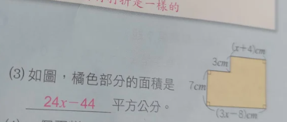
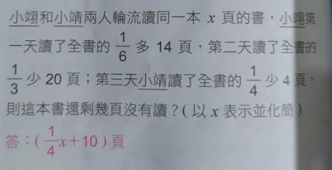

1. **題目內容**：小工設計一個電腦小程式，每按一次按鈕，螢幕左邊的數字會自動加 2，同時螢幕右邊的數字則會自動減 5。如果一開始螢幕左邊的數字為 21，螢幕右邊的數字為 66，則要按幾次按鈕後，螢幕兩邊的數字會互為相反數？
   - **解答**：**29 次**
   - **計算過程**：
     - 設需按 $x$ 次按鈕。
     - 螢幕左邊的數字變為 $21 + 2x$，右邊的數字變為 $66 - 5x$。
     - 根據「互為相反數」的條件，兩數之和為 0：$(21 + 2x) + (66 - 5x) = 0$。
     - $87 - 3x = 0 \Rightarrow 3x = 87 \Rightarrow x = 29$。

---

2. **題目內容**：若三個連續整數的和比最小數的 2 倍多 39，則最小數為多少？
   - **解答**：**36**
   - **計算過程**：
     - 設這三個連續整數為 $x$、$x+1$、$x+2$。
     - 依題意列式：$x + (x+1) + (x+2) = 2x + 39$。
     - $3x + 3 = 2x + 39 \Rightarrow x = 36$。

---
3. **題目內容**：已知一個二位數的十位數字與個位數字的和為 $13$。若將這兩位數的十位數字與個位數字互換後，所得的新數比原數大 $45$，則原數為何？
   - **解答**：**$49$**
   - **計算過程**：
     - 設原數的十位數字為 $x$，個位數字為 $(13 - x)$。
     - 原數 $= 10x + (13 - x) = 9x + 13$。
     - 新數 $= 10(13 - x) + x = 130 - 9x$。
     - 依題意列式：$(130 - 9x) - (9x + 13) = 45$。
     - $117 - 18x = 45 \Rightarrow 18x = 72 \Rightarrow x = 4$。
     - 十位數為 $4$，個位數為 $9$，故原數為 $49$。

---

4. **題目內容**：如圖，矩形 $ABCD$ 中，$AD // BC，CD \perp BC$。其中 $AD = 3，BC = 6，CD = 8$。今自 $B$ 點剪出一線段 $BN$，使得 $BN$ 將此梯形分成面積相等的兩圖形。若 $N$ 在 $CD$ 上，則 $DN = ?$
   - **解答**：**$2$**
   - **計算過程**：
     - 梯形 $ABCD$ 面積 $= \frac{(3 + 6) \times 8}{2} = 36$。
     - $BN$ 將其二等分，則三角形 $BCN$ 的面積應為 $36 / 2 = 18$。
     - 設 $CN$ 長度為 $h$，三角形 $BCN$ 面積 $= \frac{6 \times h}{2} = 3h$。
     - $3h = 18 \Rightarrow h = 6$，即 $CN = 6$。
     - $DN = CD - CN = 8 - 6 = 2$。

---

5. **題目內容**：王蘭將一正方形紙片剪去寬為 4 公分的長條，如圖(一)；再從剩下的長方形紙片上，沿著平行短邊的方向，剪下寬為 6 公分的長條，如圖(二)。如果兩次剪下的長條面積相等，則原正方形紙片的面積為多少平方公分？
   - **解答**：**144 平方公分**
   - **計算過程**：
     - 設原正方形的邊長為 $x$ 公分。
     - 第一次剪下的長條面積為 $4x$ 平方公分。
     - 第二次剪下的長條面積為 $6(x-4)$ 平方公分（因為一邊長度已縮減為 $x-4$）。
     - 依題意列出方程式：$4x = 6(x-4)$。
     - $4x = 6x - 24 \Rightarrow 2x = 24 \Rightarrow x = 12$。
     - 原面積為 $12^2 = 144$ 平方公分。

---

6. **題目內容**：某次數學小考，全班平均為 64 分。及格同學的平均為 76 分，不及格同學的平均為 48 分，且及格人數比不及格人數多 15 人。則全班共有多少人？
   - **解答**：**105 人**
   - **計算過程**：
     - 設不及格人數為 $x$ 人，則及格人數為 $(x+15)$ 人。
     - 根據總分不變的原理：$48x + 76(x+15) = 64(x + x + 15)$。
     - $48x + 76x + 1140 = 64(2x + 15)$。
     - $124x + 1140 = 128x + 960$。
     - $1140 - 960 = 128x - 124x \Rightarrow 180 = 4x \Rightarrow x = 45$。
     - 全班總人數為 $45 + (45+15) = 105$ 人。

---

7. **題目內容**：某次數學測驗共 $25$ 題，其計分方式為：答對一題得 $4$ 分，答錯一題扣 $1$ 分，沒有作答則不計分。若小明作答 $24$ 題，共得 $71$ 分，則小明答對幾題？
   - **解答**：**$19$ 題**
   - **計算過程**：
     - 設小明答對 $x$ 題，則答錯的題目為 $(24 - x)$ 題。
     - 依據得分列式：$4x - 1(24 - x) = 71$。
     - $4x - 24 + x = 71 \Rightarrow 5x = 95 \Rightarrow x = 19$。

---

8. **題目內容**：某個團體活動中，男生人數占全體人數的 4/9 多 8 人，女生人數占全體人數的 3/8 少 5 人。其餘 10 人為教師，則此團體共有多少人？
   - **解答**：**72 人**
   - **計算過程**：
     - 設全體人數為 $x$ 人。
     - 男生人數為 $\frac{4}{9}x + 8$，女生人數為 $\frac{3}{8}x - 5$。
     - 根據總人數列式：$(\frac{4}{9}x + 8) + (\frac{3}{8}x - 5) + 10 = x$。
     - $\frac{59}{72}x + 13 = x \Rightarrow \frac{13}{72}x = 13 \Rightarrow x = 72$。

---
9. **題目內容**：將一條繩子摺成等長的三段，後再去量一口井深，還多出 7 公尺；若摺成等長的四段，後再去量井深，則不足 2 公尺。請問繩長是多少公尺？井深多少公尺？
   - **解答**：**繩長 108 公尺，井深 29 公尺**
   - **計算過程**：
     - 設井深為 $x$ 公尺。
     - 繩長可表示為 $3(x + 7)$，也可表示為 $4(x - 2)$。
     - 依題意列式：$3(x + 7) = 4(x - 2)$。
     - $3x + 21 = 4x - 8 \Rightarrow x = 29$。
     - 繩長 $= 3(29 + 7) = 108$ 公尺。

10. **題目內容**：為了提升業績，某廠商決定促銷兩款不同手機，每支均賣 3000 元。已知其中一支賺 20%，另一支賠 20%。則這次促銷中，廠商是賺還是賠？賺或賠多少元？
   - **解答**：**賠 250 元**
   - **計算過程**：
     - 第一支賺 20%：設成本為 $x$ 元，$1.2x = 3000 \Rightarrow x = 2500$。賺了 $3000 - 2500 = 500$ 元。
     - 第二支賠 20%：設成本為 $y$ 元，$0.8y = 3000 \Rightarrow y = 3750$。賠了 $3750 - 3000 = 750$ 元。
     - 整體盈虧為 $500 - 750 = -250$，即賠 250 元。

---

11. **題目內容**：$10$ 年前祖父的年齡比小明的 $8$ 倍少 $1$ 歲，$10$ 年後祖父的年齡比小明的 $2$ 倍多 $15$ 歲，則今年兩人年齡各是多少歲？
    - **解答**：**小明 $16$ 歲，祖父 $57$ 歲**
    - **計算過程**：
      - 設小明今年 $x$ 歲，祖父今年 $y$ 歲。
      - $10$ 年前：$y - 10 = 8(x - 10) - 1 \Rightarrow y = 8x - 71$ --- (1)
      - $10$ 年後：$y + 10 = 2(x + 10) + 15 \Rightarrow y = 2x + 25$ --- (2)
      - 由 (1)、(2) 得：$8x - 71 = 2x + 25 \Rightarrow 6x = 96 \Rightarrow x = 16$。
      - 代入 (2)：$y = 2(16) + 25 = 57$。

---

12. **題目內容**：珍珠和家人到農場遊玩，購買了 $3$ 張全票及 $4$ 張半票，總共花了 $1000$ 元。已知每張半票比每張全票便宜 $30$ 元。若每張全票定價為 $x$ 元，則：
    (1) 依題意可列出一元一次方程式為何？
    (2) 承 (1)，可得每張全票的票價為多少元？
    - **解答**：**(1) $3x + 4(x - 30) = 1000$；(2) $160$ 元**
    - **計算過程**：
      - (1) 設全票每張 $x$ 元，則半票每張 $(x - 30)$ 元。
      - 根據總花費列式：$3x + 4(x - 30) = 1000$。
      - (2) 展開方程式：$3x + 4x - 120 = 1000 \Rightarrow 7x = 1120 \Rightarrow x = 160$。
---

2. **題目內容**：幸福百貨公司週年慶舉辦促銷活動，其促銷方式如下：
   一、全館定價相同的服飾每買 3 件，第 3 件免費。
   二、消費總金額達 3000 元以上（含），可再享八折優惠。
   小玲和小臻兩姊妹一起到幸福百貨公司購物，小玲選了定價 $x$ 元的上衣 2 件及定價 1500 元的上衣 1 件；小臻選了定價 $x$ 元的上衣 4 件及定價 2500 元的外套 1 件。若兩人一起結帳共付了 4640 元，試求：
   (1) $x$ 之值為何？
   (2) 若兩人分開結帳，則小臻需付多少元？
   - **解答**：**(1) $x = 450$；(2) $3080$ 元**
   - **計算過程**：
     - (1) 兩人合買的上衣中，定價相同的 $x$ 元上衣共有 $2 + 4 = 6$ 件。
     - 依據「買 3 件第 3 件免費」，6 件只需付 4 件的錢，費用為 $4x$ 元。
     - 總金額（折扣前）為 $4x + 1500 + 2500 = 4x + 4000$ 元。
     - 因總金額達 3000 元，享八折優惠，方程式為：$(4x + 4000) \times 0.8 = 4640$。
     - $4x + 4000 = 5800 \Rightarrow 4x = 1800 \Rightarrow x = 450$。
     - (2) 小臻買了 4 件 450 元上衣與 1 件 2500 元外套。
     - 4 件 450 元上衣只需付 3 件的錢：$3 \times 450 = 1350$ 元。
     - 小臻的折扣前總額為 $1350 + 2500 = 3850$ 元。
     - 因 $3850 \ge 3000$，享八折優惠：$3850 \times 0.8 = 3080$ 元。

---
