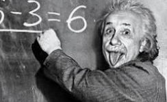

<link href="https://fonts.googleapis.com/css2?family=Noto+Sans+TC:wght@400;700&family=LXGW+WenKai+Mono+TC&family=Zhi+Mang+Xing&family=Chiron+GoRound+TC&display=swap" rel="stylesheet">

20251229 主日信息
===

得勝之後，怎麼活？——來自大衛王的人生智慧
---

<link href="https://www.youtube.com/live/1NnTYriH_EQ">

## 1. 前言：重新定義「得勝」的意義

弟兄姊妹平安。

我時常思想，我們這個時代最深的渴望是什麼？年底是反思的季節，這份心得是基於張永和牧師分享的一篇深刻信息，核心經文是舊約中的《歷代志上》第十八章。

如果我問你：「現在人生中最想得勝的是哪一件事？」或許你的答案會是：希望考試順利過關、希望工作專案完成並獲得升遷、希望家庭關係能改善、希望孩子平安長大不走偏、希望病得醫治。我們都渴望「得勝」，渴望禱告蒙應允，渴望不再被同樣的軟弱打敗。

然而，神今天要帶我們思考一個更深層次、也更具挑戰性的問題：「如果有一天，你夢寐以求的勝利真的到來了，那接下來呢？」

這讓我想到一個有趣的生活對比。前幾天我家孩子搭飛機回來，我問他想吃什麼，他說：「沒肉怎麼活？」這句話觸動了我，讓我們從一個更屬靈的角度來問自己：「得勝之後，怎麼活？」我們花了許多力氣想「打贏仗」，卻很少思想，得勝之後，我們要成為一個怎樣的人？

事實上，《歷代志上》第十八章記載了大衛王一連串輝煌的軍事勝利，但聖經作者卻花了極大的篇幅，不是在描述戰役多麼精彩，而是在記錄大衛得勝之後「做了什麼」。這提醒我們，無論是剛找到工作、剛度過難關，還是剛完成一項服事，得勝之後，才是真正考驗的開始。這場考驗關乎的，不僅是我們取得了什麼成就，更是我們想成為什麼樣的人。

本篇信息，旨在透過大衛王的經歷，引導我們一同思考，如何在人生的每一個高峰期，活出謙卑、感恩且蒙神喜悅的樣式。

--------------------------------------------------------------------------------

## 2. 核心主題與總結要訣

在我們深入探討大衛王的人生智慧之前，讓我們先提煉出這篇信息的核心論點與四大實踐要訣。這不僅是理論的梳理，更是關乎我們每日生活的屬靈操練。掌握這個框架，將幫助我們更清晰地理解，如何在得勝的時刻站立得穩。

* 要訣一：警醒得勝後的三大危險。 勝利的果實雖然甜美，卻也伴隨著屬靈的陷阱。我們必須警惕三種試探：將勝利視為終點而停滯不前、將榮耀歸於自己而心生驕傲、以及將神的賜福據為己有而陷入貪婪。
* 要訣二：歸回得勝的唯一源頭。 在盤點戰功時，要時刻提醒自己，所有的成就皆來自神的恩典，而非個人的能力或努力。經文反覆強調「耶和華都使他得勝」，就是要我們牢記，神才是勝利的唯一源頭。
* 要訣三：獻上得勝的感恩回應。 真正的感恩，體現在具體的行動上。這意味著我們需要學習大衛，將所得的「戰利品」——恩賜、資源、時間、金錢——「分別為聖」，投資於永恆的價值，使其成為祝福下一代的資產。
* 要訣四：活出得勝的最終見證。 神所看重的，最終不是我們的戰功有多輝煌，而是我們的品格有多正直。最高的勝利，是在日常生活中實踐「秉公行義」的生命樣式，成為一個站得正，而非站得高的人。

## 3. 論點綱要卡片

--------------------------------------------------------------------------------

## 4. 深度講述：從大衛王學習得勝後的人生四課

### 4.1 第一課：得勝是真正考驗的開始

我必須坦誠地說，人生的高峰時刻，往往伴隨著最大的屬靈危險。當我們站在山頂，視野開闊，掌聲環繞，正是最容易迷失方向的時候。這一課，我們將深入分析得勝後常見的三種試探，幫助我們在歡慶的氛圍中保持警醒。

危險一：把勝利當作終點（停滯的危險）

大衛在戰勝勁敵非利士人後，並沒有停下來大開慶功宴就此滿足。經文記載，他繼續面對摩押、亞蘭等新的挑戰。他深知，美好的仗打過了，當跑的路卻還未跑盡。

然而，在我們的屬靈生活中，卻常常有「夠了」的心態：

* 「我已經受洗了，夠了。」
* 「我每週日都來教會了，夠了。」
* 「我讀完聖經一遍了，夠了。」
* 「我今年有邀一個人來教會，夠了。」

這種滿足於現狀的心態，是屬靈生命停滯的開始。生命是一場持續奔跑的賽程，每一個得勝的里程碑，都應是下一個起點，而不是終點。

危險二：把榮耀歸給自己（驕傲的危險）

經文中兩次不厭其煩地重複一句話：「耶和華都使他得勝。」（第6、13節）為什麼要重複？因為我們太容易忘記了！人在困難中容易倚靠神，但在順境中，卻極其容易倚靠自己，將榮耀歸於自己。

這個試探有多真實，我必須承認，我自己就曾深深地經歷過。多年前在中國佈道，一場聚會有兩萬多人，呼召時幾乎所有人都舉手回應。那一刻，我感覺自己整個人都「飛起來了」，彷彿自己是個了不起的人物。這就是驕傲的試探，它來得如此真實，又如此隱蔽。大衛需要這個提醒，我們更需要。

讓我們誠實地問自己：

* 最近一次成功，我第一個感謝的是誰？
* 別人稱讚我時，我心裡真實的想法是什麼？是否暗暗覺得「這是我應得的」？

危險三：把戰利品據為己有（貪婪的危險）

得勝之後的終極考驗是：你如何處理「戰利品」？ 大衛的行動給出了答案，他將從各國奪來的金銀器皿，「都分別為聖獻給耶和華。」（第11節）

對我們而言，現代的「戰利品」可能是：

* 升職後的權力
* 發財後的金錢
* 成名後的名聲
* 成功後的資源

大衛選擇了「分別為聖」，意思是「分別出來，歸給神」。他沒有像掃羅王那樣，因貪戀肥美的牛羊而違背神的命令。他清楚知道，這一切都源於神，也當歸於神。

辨識並戰勝這三大內在的危險，是我們從一次的勝利，走向更成熟生命的必經之路。

### 4.2 第二課：得勝的源頭是永不動搖的神

處理了得勝後的危險，接下來我們要校準一個更根本的認知：得勝的源頭是誰？ 這一課的焦點，是從「我做了什麼」轉向「我倚靠誰」。

《歷代志上》第18章乍看之下，像是一張大衛輝煌的「軍事戰績表」，記錄了他對非利士、摩押、瑣巴、亞蘭等國的連串勝利。然而，作者的筆鋒一轉，兩次嵌入了整章的關鍵句：「大衛無論往哪裡去，耶和華都使他得勝。」

作者的意圖非常明確：他不是要我們記住大衛有多強大，而是要我們牢記——得勝的唯一源頭是神。

這就像一個孩子考試考得很好，如果他只說：「我很聰明、我很努力」，卻從不提及父母的陪伴與老師的教導，那他其實是看不見恩典真正的源頭。大衛之所以能持續得勝，不是因為他總能做出最完美的決策，而是因為神的同在與恩典始終伴隨著他。

這對我們的日常生活是極大的提醒：

* 工作順利時，我們會不會以為全是自己能力強？
* 孩子表現好時，我們會不會只歸功於自己的教養方法對？
* 服事有果效時，我們會不會不知不覺開始倚靠自己的經驗，而不是倚靠神？

今天，神要提醒我們每一個人：不要把神在背後默默的祝福與扶持，誤認為是自己的本事。 既然一切勝利都源於神，那麼我們得勝後的回應，理所當然也應當全然指向神。

### 4.3 第三課：以奉獻和傳承回應神的恩典

當我們確認勝利的源頭是神，內心充滿感恩時，這種感恩不應停留在口頭上，而需要有具體的行動來表達。這一課，我們將看到大衛如何透過「奉獻」與「為未來預備」這兩大行動，來回應神的浩大賜福。

行動一：以「分別為聖」表達感恩

在那個君王們為建立自己的榮耀、累積自己的財富、擴張自己的權力而發動戰爭的年代，大衛的選擇顯得獨樹一幟。面對從各國奪來的金、銀、銅等巨大財富，他沒有將其視為私有財產，而是做出一個截然不同的決定：「都分別為聖獻給耶和華。」他選擇了將這一切再次交回神的手中。

這教導我們，奉獻是感恩最直接的體現。而「奉獻」的觀念可以擴展到金錢之外：

* 當神賜福你的時間，你願意拿出一部分來服事嗎？
* 當神賜福你的恩賜與能力，你願意用來幫助人嗎？
* 有時候，奉獻甚至可以只是一句真誠鼓勵的話。

行動二：以「預備未來」投資永恆

經文中有一個看似微小卻意義深遠的細節：「（大衛奪取的許多銅）後來所羅門用此製造銅海、銅柱，和一切的銅器。」（第8節）大衛的奉獻，不僅是當下的感恩，更是為下一代——他的兒子所羅門建造聖殿——預備材料。

真正的得勝者，不只為自己，更為下一代。 他的眼光超越了今生，投資在永恆的國度裡。這也挑戰我們去思考：

* 你現在的「得勝」，如何能夠祝福後來的人？
* 你能留下什麼寶貴的「屬靈資產」給你的孩子或教會的下一代？
* 你的成功，是只為自己，還是能成為流通的管道，去祝福他人？

真正的得勝者，會讓自己的生命成為一個「流通的祝福」，從神領受恩典，再將恩典傳遞出去。這份流動的生命，最終將體現在他日常的生活樣式中。

### 4.4 第四課：活出公義與正直的最終見證

《歷代志上》第18章在記錄完大衛赫赫的戰功之後，用一句話為他的人生作了「屬靈的結論」：「大衛作以色列眾人的王，又向眾民秉公行義。」（第14節）這句話揭示了神最終極的評價標準。神沒有說「大衛戰無不勝」，而是稱讚他施行「公平與公義」。這提醒我們，在神的眼中，站得多正，遠比站得多高更重要。

見證的核心：品格勝過成就

我們所處的世代，很容易重視成果而忽略品格、重視效率而忽略公義。但聖經的價值觀恰恰相反，它看重的是我們內在的生命是否公平、正直、充滿憐憫。

「秉公行義」不應只是掛在嘴邊的口號，而應落實在生活的每個場景中：

* 在職場，你是否願意誠實，公平待人？
* 在家庭，你是否耐心聆聽，不以權威壓制家人？
* 在教會，你是否樂意服事，不追求舞台上的表現與人的掌聲？

見證的維護：砍斷次要的倚靠

一個得勝的生命，需要持續的維護。大衛有兩個行動值得我們深思。第一，他「將拉戰車的馬砍斷蹄筋」（第4節）。在古代，戰馬是軍事實力的象徵。大衛主動放棄對這種軍事優勢的倚靠，表明他選擇單單倚靠神。這挑戰我們反思：什麼是我的「戰馬」？是我需要「砍斷蹄筋」的倚靠？（例如：自己的聰明、人脈、經驗）

第二，大衛建立了完善的治理體系（第14-17節），讓官員各司其職。這提醒我們，宏大的勝利需要務實的體系來承載。屬靈的高峰經歷需要日常的紀律來維護。正如特會的感動，需要回到小組生活中去深化；病得醫治後，仍需要建立健康的習慣。

見證的實踐：把神擺在第一位並保守己心

那麼，我們如何才能活出公義和正直呢？聖經給了我們兩個核心的行動指南：

1. Seek God first (把神擺在第一位): 正如《馬太福音》所教導，「你們要先求他的國和他的義，這些東西都要加給你們了。」當我們將神的國度放在首位，我們的價值觀和優先次序就會被校準。
2. Guard your heart (保守你的心): 耶穌用無知財主的比喻警示我們，那為自己積財，在神面前卻不富足的人是何等危險（路加福音12:21）。使徒們也一再強調保守己心的重要性。雅各警告說，我們求也得不著，是因為「妄求」，想要浪費在自己的宴樂中（雅各書4:3）。約翰更直接地點出：「人若愛世界，愛父的心就不在他裡面了。」（約翰一書2:15）因為肉體的情慾、眼目的情慾和今生的驕傲，都與神為敵。保守己心，就是勝過這一切，因為一生的果效是由心發出。

大衛的得勝，最終不是停留在戰場的功勳上，而是落實在每日生活的公義中。這才是他留給我們最寶貴的見證。

--------------------------------------------------------------------------------

## 5. 結論：得勝是為了實踐福音使命

親愛的弟兄姊妹，今天神透過大衛的故事，不斷地在問我們：「得勝之後，你怎麼活？」

我們看見，大衛「秉公行義」的生命，正是他得勝後的生活見證。這讓我們明白，得勝的真正意義，從來不是為了讓我們享受特權、高舉自己，而是為了能更好地實踐福音使命，成為服事他人的僕人。

* 在家庭中，得勝的父母會變得更恩慈。
* 在職場中，得勝的員工會變得更謙卑。
* 在教會中，得勝的弟兄姊妹會更願意服事人。

大衛預表了基督，但只有耶穌基督是那位完全的得勝者。祂戰勝了罪惡、死亡與撒但，但祂的得勝不是為了自己享受榮耀，而是「虛己，取了奴僕的形像」（腓立比書2:7）。祂為我們活，為我們死，為我們復活，如今仍在為我們代求。這才是得勝的終極意義：降卑服事，作眾人的僕人。

* 給學生們： 考試得勝後，你是驕傲地看不起同學，還是願意去幫助那些跟不上的同學？
* 給上班族： 專案成功後，你是獨攬功勞，還是將榮耀歸給團隊？升職加薪後，你如何對待下屬、管理金錢？
* 給父母們： 當孩子有好表現時，你是到處炫耀比較，還是引導孩子將榮耀歸給神，並教導他成功是為了服務他人？
* 給所有人： 禱告蒙應允後，你怎麼活？你是否見證神的作為？是否繼續信靠神？是否用蒙恩的經歷去鼓勵他人？

今天，我邀請你，對神在你生命中的作為做出回應。請你做出三個決定：

1. 感恩的決定： 不再猶豫，今天就把一切的榮耀歸給神。
2. 奉獻的決定： 檢視你的「戰利品」（時間、金錢、恩賜），將它分別為聖獻給神。
3. 服事的決定： 用神所賜給你的得勝，去祝福、去服事你身邊的人。

--------------------------------------------------------------------------------

## 6. 結束的代禱

親愛的天父，我們來到祢的施恩座前，用心靈和誠實尋求祢。我們何等地需要祢，如同詩歌所唱：「每一天我需要祢」。主啊，求祢幫助我們，在經歷得勝、站在高峰時，能有一顆謙卑、警醒與感恩的心。

求祢賜給我們從大衛王而來的智慧，懂得如何處理祢所賜的恩典與「戰利品」，不是為自己積攢，而是學習分別為聖，投資在永恆的國度裡，去祝福更多的人。

主啊，更求祢保守我們的心，勝過保守一切。幫助我們在生活中活出公義與正直，讓我們生命的見證，不是我們站得多高，而是我們在祢面前站得多正。願我們永不失去起初愛祢的心，讓我們的一生，單單為榮耀祢而活。

我們這樣同心禱告，是奉靠我主耶穌基督得勝的名求。阿們。

